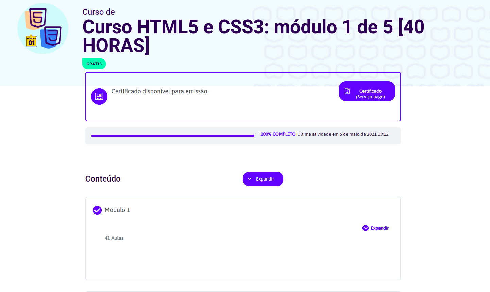

# Curso HTML5 e CSS3: módulo 1 de 5 [40 HORAS]

### Premissa
Neste modulo um estudo inicial de HTML5, envolvendo história da tecnologia e a forma correta de usa-la

<a href="https://www.youtube.com/watch?v=Ejkb_YpuHWs&list=PLHz_AreHm4dkZ9-atkcmcBaMZdmLHft8n" target="_blank">Acesse a playlist do curso aqui</a>
